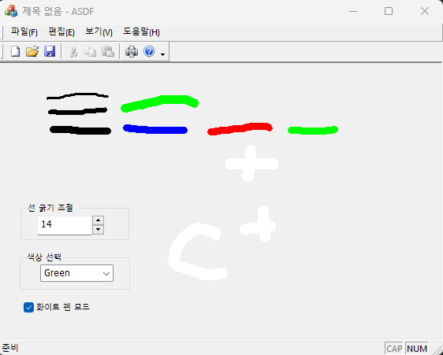

</br>
비주얼프로그래밍 팀프로젝트 4팀</br>
20191276 양용석 </br>
</br>

1. 구현한 기능</br>
  1) EditBox, Spin Control을 연동해 EditBox의 컨트롤 값에 따라 펜의 굵기 변경, Spin Control을 통해 조절 가능</br>
  2) ComboBox를 사용해 선택한 데이터의 색상에 따라 펜의 색상 변경</br>
  3) CheckBox를 사용해 체크 시, 펜의 색상 변경</br>
</br>
2-1 프로젝트 </br>
 프로젝트 명 : ASDF  </br>
 FormView 생성, 단일 문서 기반  </br>
 클래스 명 : ASDFView  </br>
  </br>
   </br>
   
2-2. 코드</br>
```
*** 
 CPoint oPnt;
 struct Line {      //구조체 형성, 기능에 필요한 생성자 선언
	CPoint start;
	CPoint end;
	int penWidth;
	COLORREF color;
};
***

</br>

*** 
std::vector<Line> lines; //벡터를 사용한 선 추가

void CASDFView::OnLButtonDown(UINT nFlags, CPoint point)  //마우스 왼쪽버튼을 누르는 동안의 포인터 위치 적용  
{
	oPnt = point;
	CFormView::OnLButtonDown(nFlags, point);
}
***

 </br>
 

void CASDFView::OnMouseMove(UINT nFlags, CPoint point)
{
	if (nFlags & MK_LBUTTON) { // 마우스 왼쪽 버튼의 상태만 확인
		CClientDC dc(this);      // 여기서 DC를 얻음
  	//펜 굵기 가져오기
  	CString PenW;
		m_Edit.GetWindowTextW(PenW);
		int penW = _ttoi(PenW);
		COLORREF color;
    //체크박스의 체크 여부에 따라 체크시 True, 아닐시 else 값 반환
		if (m_Check.GetCheck() == BST_CHECKED) {
			// If the checkbox is checked, use the eraser.
			color = RGB(255, 255, 255);  // Assuming your background is white
		}
		else {
			int SelectedColor = m_Cmb.GetCurSel();
			CString PenC;
//콤보박스에 표시된 문자를 받고 그 문자에 따라 맞는 펜 색상으로 변경
			if (SelectedColor != CB_ERR)
				m_Cmb.GetLBText(SelectedColor, PenC);
			else
				PenC = _T("Black");  // Default to black if no color is selected
			if (PenC.CompareNoCase(_T("Red")) == 0)
				color = RGB(255, 0, 0);
			else if (PenC.CompareNoCase(_T("Green")) == 0)
				color = RGB(0, 255, 0);
			else if (PenC.CompareNoCase(_T("Blue")) == 0)
				color = RGB(0, 0, 255);
			else
				color = RGB(0, 0, 0);     // 기본값은 검은색 
		}
 //펜 설정
		CPen pen(PS_SOLID, penW, color);
		CPen* poldPen = dc.SelectObject(&pen);
//펜 동작
		dc.MoveTo(oPnt);
		dc.LineTo(point);
//현재 값 벡터에 저장
		lines.push_back({ oPnt , point , penW ,color });
		oPnt = point;      // 현재 위치 저장
//화면 갱신
		Invalidate();   // Add this line to invalidate the window
//데이터 갱신
		UpdateData();
	}
}
***

 </br>
 
***
//그리는 기능 구현
void CASDFView::OnPaint()
{
	CPaintDC dc(this); // device context for painting
//
	for (const auto& line : lines) {
		CPen pen(PS_SOLID, line.penWidth, line.color);
		CPen* poldPen = dc.SelectObject(&pen);
//위의 마우스 포인터에 따라 움직임
		dc.MoveTo(line.start);
		dc.LineTo(line.end);
		dc.SelectObject(poldPen);
	}
}
***
</br>

***
//스핀 컨트롤 클릭 시 에디트텍스트의 값 변경, 값 갱신
void CASDFView::OnDeltaposSpin1(NMHDR* pNMHDR, LRESULT* pResult) {
	LPNMUPDOWN pNMUpDown = reinterpret_cast<LPNMUPDOWN>(pNMHDR);
	CString str;
	str.Format(_T("%d"), pNMUpDown->iPos + pNMUpDown->iDelta);
	m_Edit.SetWindowTextW(str);
	m_Spin.SetRange(1, 100);
	UpdateData(FALSE);
	Invalidate();
	UpdateWindow();
}
***
```

   </br>

   3. 실행 화면 </br>
</br>
</br>
 </br>

  </br>
</br>
  4. 사용한 컨트롤 </br>
Combo Box, EditText, Spin Control, Check Box, Group Box  </br>

